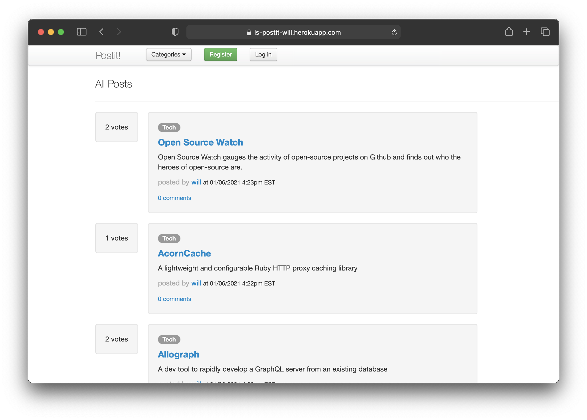

# Postit

* **Try it out:** [https://postit-wlotherington.herokuapp.com/](https://postit-wlotherington.herokuapp.com/)
* **Stack:** `Ruby`, `Rails`, `JavaScript`, `jQuery`
* **Feedback:** [Will.Lotherington@hey.com](mailto:Will.Lotherington@hey.com)

### What is it?
Reddit clone built using Ruby on Rails

